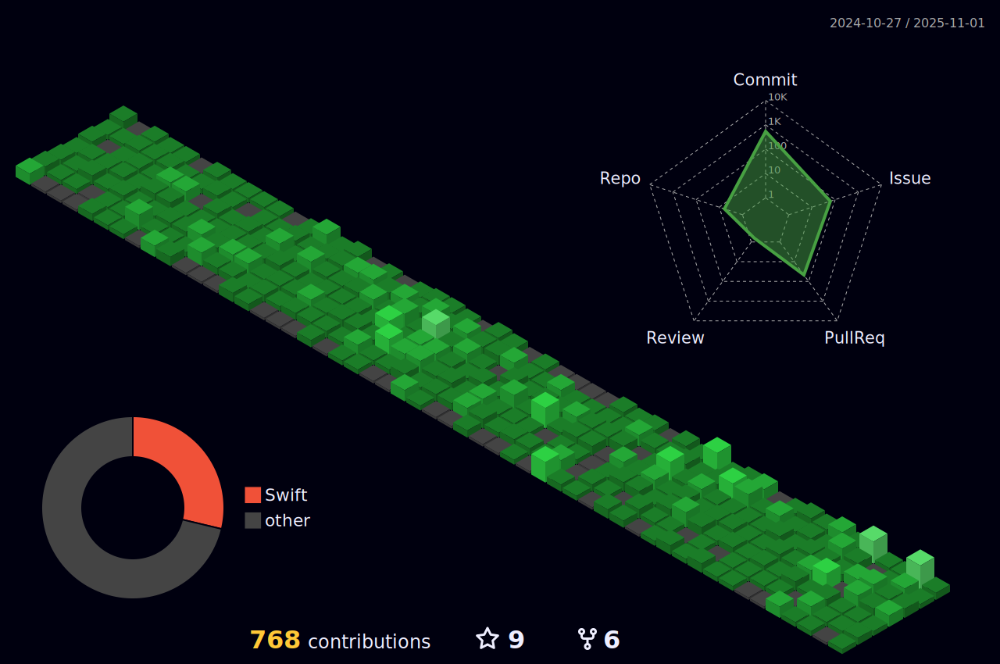

### 
 I'm Kyeongmo Yang   A software engineer who aims to write easy-to-read code and  knows the value of communication and collabolation   working since 2020 🚀 
  

- 📠I regularly write posts on [</a>](https://gaeng2y.medium.com).
 
- 🌱 I’m currently learning Clean Architecture / Code, Design Pattern, Combine Framework.

- 💡 Let's think about iOS together.

## Skills

</a>
</a>
</a>
</a>
</a>
 
</a>
</a>
</a>
</a>
</a>
 

## Contributes

## Connect

 

  
